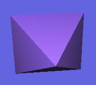



## UPDATED DIRECTX8 TUTORIAL\!\!\!

### Description

EGAD!!! It's a work-in-progress tutorial for D3D in DirectX 8!!!!!  

Featuring:  

* Initialisation!!!!  

* Vectors and stuff like that!!  

* Matricies!!!!!  

* Luvly little spinning shapes!!!!  

* Lighting!!!!!  

* No Ants!!!!  

* A smashing logo!!!!  

NOW WITH UPDATED CLEARER CODE AND TEXTURING!!!!

 

WOW! So much stuff! So little ants! Vote if you like, i'm more interested in comments. Tell what u like and what is good about it, tell me what is awful and how to improve it!

(thanks to simon price for his DX stuff)
 
### More Info
 

             |
---                |---
**Submitted On**   |2002-02-10 14:48:20
**By**             |[necromunda](https://github.com/Planet-Source-Code/PSCIndex/blob/master/ByAuthor/necromunda.md)
**Level**          |Intermediate
**User Rating**    |5.0 (70 globes from 14 users)
**Compatibility**  |VB 6\.0
**Category**       |[DirectX](https://github.com/Planet-Source-Code/PSCIndex/blob/master/ByCategory/directx__1-44.md)
**World**          |[Visual Basic](https://github.com/Planet-Source-Code/PSCIndex/blob/master/ByWorld/visual-basic.md)
**Archive File**   |[UPDATED\_DI543912102002\.zip](https://github.com/Planet-Source-Code/necromunda-updated-directx8-tutorial__1-31228/archive/master.zip)

